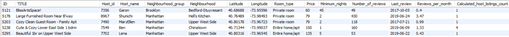
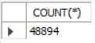
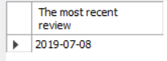
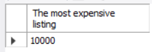
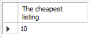
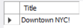
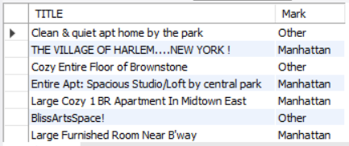
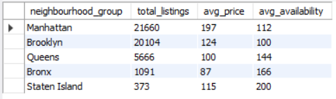

# 🗽 Airbnb NYC 2019 – SQL & Power BI Project

This project is a SQL and Power BI analysis of the Airbnb NYC 2019 dataset. I chose this dataset because I love New York City, and I wanted to practice SQL and Power BI together while uncovering interesting insights about the city’s rental landscape.

---

## 📌 Objectives

- Practice SQL querying, data cleaning, and transformation
- Use Power BI for visualization and dashboard creation
- Explore trends in pricing, availability, and host activity in NYC

---

## 🛠️ Tools Used

- MySQL (local)
- MySQL Workbench
- Power BI
- Dataset: [Inside Airbnb - NYC 2019](http://insideairbnb.com/get-the-data.html)

---

## 📊 SQL Analysis with Visuals

### ✅ 1. Check if the table is working

```sql
SELECT * FROM NY_HOUSES2 LIMIT 10;
```


---

### ✅ 2. Change column type of `Last_review` from VARCHAR to DATE

```sql
ALTER TABLE NY_HOUSES2 MODIFY Last_review DATE;
```

---

### ✅ 3. Count number of rows

```sql
SELECT COUNT(*) FROM NY_HOUSES2;
```


---

### ✅ 4. Count NULLs in `Last_review`

```sql
SELECT COUNT(*) FROM NY_HOUSES2 WHERE Last_review IS NULL;
```
[null_count](https://github.com/EduardTadevosyan/NYC_AirBnB_SQL/blob/main/images/count_of_the_null_values.png)

---

### ✅ 5. Most recent review

```sql
SELECT Last_review AS 'The most recent review'
FROM NY_HOUSES2
ORDER BY Last_review DESC 
LIMIT 1;
```


---

### ✅ 6. Most expensive listing

```sql
SELECT Price AS 'The most expensive listing'
FROM NY_HOUSES2 
ORDER BY Price DESC
LIMIT 1;
```


---

### ✅ 7. Cheapest listing

```sql
SELECT Price AS 'The cheapest listing'
FROM NY_HOUSES2 
WHERE Price != 0
ORDER BY Price ASC
LIMIT 1;
```


---

### ✅ 8. Disable SQL safe update mode

```sql
SHOW INDEX FROM NY_HOUSES2;
SET SQL_SAFE_UPDATES = 0;
```

---

### ✅ 9. Update a listing's title

```sql
UPDATE NY_HOUSES2
SET TITLE = 'Downtown NYC!'
WHERE ID = 12192;

SELECT Title FROM NY_HOUSES2 
WHERE ID = 12192;
```


---

### ✅ 10. Delete a row

```sql
DELETE FROM NY_HOUSES2
WHERE ID = 2595;
```

---

### ✅ 11. Listings in Manhattan vs Other

```sql
SELECT TITLE,
    CASE
        WHEN Neighbourhood_group = 'Manhattan' THEN 'Manhattan'
        ELSE 'Other'
    END AS Mark
FROM NY_HOUSES2;
```


---

### ✅ 12. Borough-level statistics

```sql
SELECT 
    neighbourhood_group, 
    COUNT(id) AS total_listings, 
    ROUND(AVG(price)) AS avg_price, 
    ROUND(AVG(availability_365)) AS avg_availability
FROM NY_HOUSES2
GROUP BY neighbourhood_group
ORDER BY total_listings DESC;
```


---

## 📈 Key Learnings

- SQL is powerful for both cleaning and exploring real-world datasets
- Grouped aggregations reveal pricing patterns across boroughs
- Small update/delete operations simulate realistic data manipulation

---

## 🧑‍💻 Author

**Edmond Tadevosyan**  
Aspiring Data Analyst • Learning by doing • New York City enthusiast  
🎯 SQL • Power BI • Python


